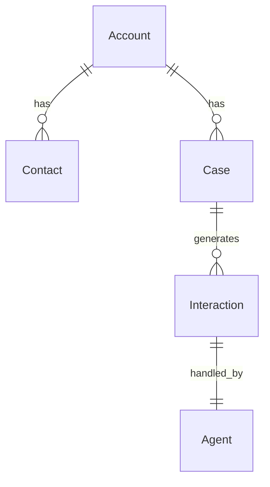

import { Callout } from 'fumadocs-ui/components/callout';

# Data Model

The shape of the data that powers the __POC_NAME__.

## Entity overview

> **TODO (__SE_NAME__)**: Replace with the actual ERD. Include custom objects and key lookups used by Agentforce topics / Flows.

## Objects

### Standard objects used

| Object | Purpose | Fields of note |
|--------|---------|----------------|
| Account | Customer entity | _fill in_ |
| Contact | Person | _fill in_ |
| Case | Unit of work | _fill in_ |

### Custom objects

| Object | API Name | Purpose |
|--------|----------|---------|
| _Example_ | `__POC_SLUG___Record__c` | _fill in_ |

For each custom object, document:

- Fields (name, type, help text)
- Validation rules
- Sharing model (Public R/W, Private + sharing rules, etc.)
- Triggers / Flows attached

## Identity & access

- **Personas**: __PERSONAS__
- **Permission sets**: `__POC_SLUG___User`, `__POC_SLUG___Admin`
- **Profiles changed**: _list any profile modifications_

## Data Cloud mapping

> Only applies if __PRODUCT_AREA__ includes Data 360.

| Source | DLO | DMO | Identity Resolution |
|--------|-----|-----|--------------------|
| _Salesforce CRM_ | _dlo_ | _dmo_ | _key_ |
| _Integration source_ | _dlo_ | _dmo_ | _key_ |

<Callout type="info" title="Sample data">
The `data/` folder in the repo contains a `plan.json` + sample records loaded via `sf data tree import`. Use it to reproduce demo scenarios.
</Callout>

## Sharing & governance

- Record ownership model
- Field-level security considerations
- Retention / purge expectations

## Open items

- [ ] _Sharing model review_
- [ ] _Field-level security pass_
- [ ] _Data retention decision_
